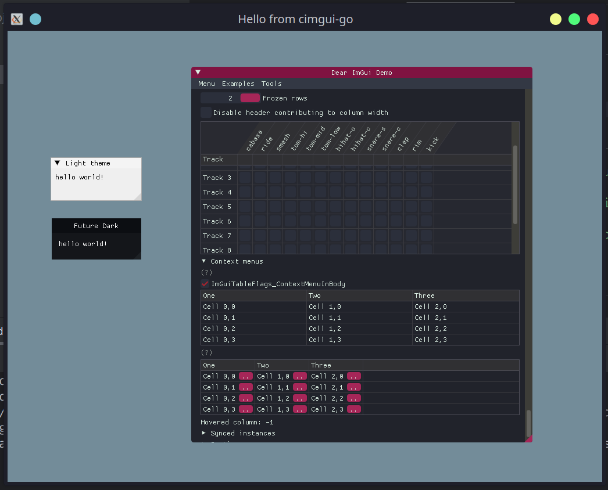

# cimgui-go-themes
ImTheme parser for cimgui-go! 




## Updating
```shell
git clone --recursive https://github.com/cimgui/cimgui.git
```

Or if already cloned:
```
git submodule update --init --recursive #(If already cloned)
```


# Usage
```go
package main

import (
	"fmt"
	imgui "github.com/AllenDang/cimgui-go"
	"github.com/damntourists/cimgui-go-themes"
)

var (
	backend imgui.Backend[imgui.GLFWWindowFlags]
	theme   *imthemes.Theme
)

func loop() {
	themeFin := theme.Apply()
	defer themeFin()

	imgui.ShowDemoWindow()
}

func main() {
	t, err := imthemes.GetThemeByName("Future Dark")
	if err != nil {
		panic(err)
	}
	theme = t

	backend, _ = imgui.CreateBackend(imgui.NewGLFWBackend())
	backend.SetBgColor(imgui.NewVec4(0.45, 0.55, 0.6, 1.0))
	backend.CreateWindow("Hello from cimgui-go", 1200, 900)
	backend.SetDropCallback(func(p []string) {
		fmt.Printf("drop triggered: %v", p)
	})

	backend.SetCloseCallback(func(b imgui.Backend[imgui.GLFWWindowFlags]) {
		fmt.Println("window is closing")
	})

	backend.Run(loop)
}    
```
